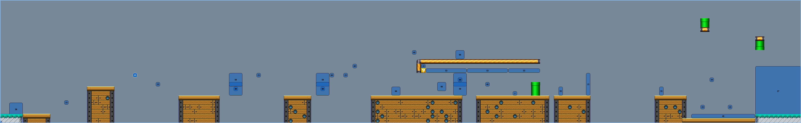

# PointlessMaker
Super Mario Maker level viewer


Download level here    
https://smmdb.ddns.net/courses      


https://conda.io/miniconda.html  (Needs python3)     

````shell
    conda create --name supermario
    source activate supermario
    conda install -c dsdale24 pyqt5
    python main.py
````
     



